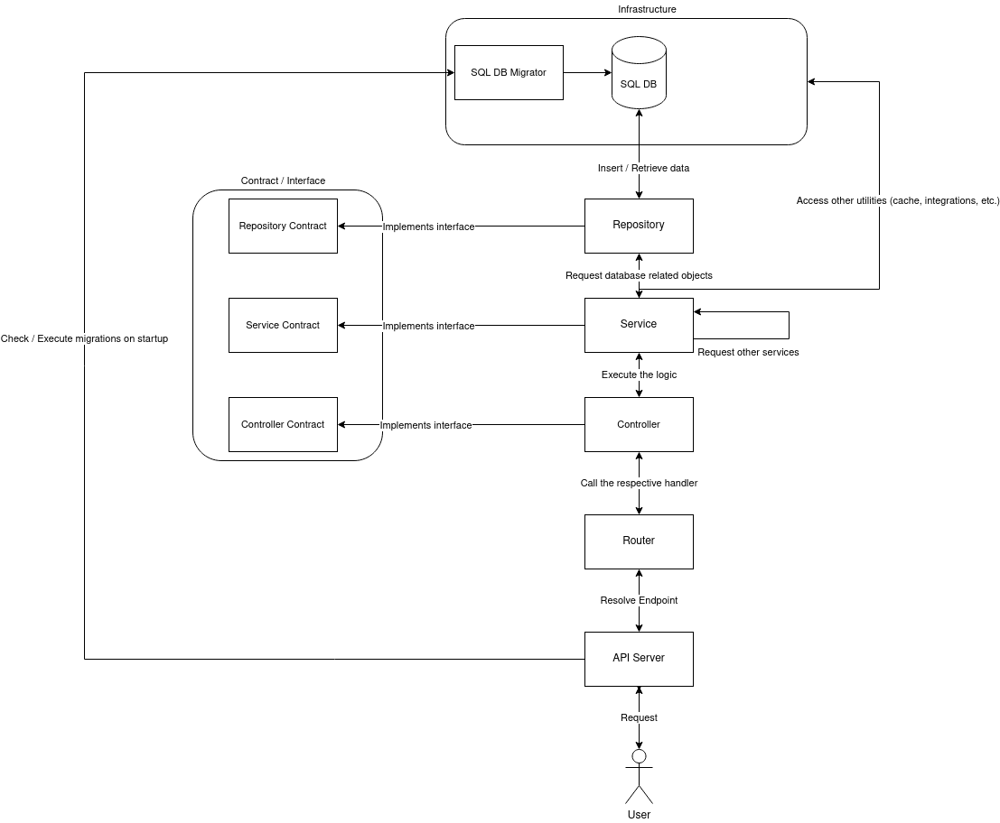

# Go Api Template

This API model was made using:

- [Migrate (golang-migrate/migrate)](https://github.com/golang-migrate/migrate) for migration handling
- [Gin (gin-gonic)](https://github.com/gin-gonic/gin) to construct API handlers and middlewares
- [Sqlx (jmoiron/sqlx)](https://github.com/jmoiron/sqlx) to make the database access layer
- [Ginkgo (onsi/ginkgo)](https://github.com/onsi/ginkgo) for unit and integration tests construction
- [GoMock (golang/mock)](https://github.com/golang/mock) to create mocks for API services and repository layer

## Migrations

### Setup

To create new migrations on the model, it is necessary to use [golang-migrate/migrate command-line tool](https://github.com/golang-migrate/migrate/tree/master/cmd/migrate). On Ubuntu you need to do the following steps:

```
sudo su (enters superuser, if you need to)
curl -L https://packagecloud.io/golang-migrate/migrate/gpgkey | apt-key add -
echo "deb https://packagecloud.io/golang-migrate/migrate/ubuntu/ $(lsb_release -sc) main" > /etc/apt/sources.list.d/migrate.list
apt-get update
apt-get install -y migrate
(exits superuser)
```

### Usage

To create a new migration, use the following command:

```
migrate create -ext sql -dir infra/migrations -seq <migration_name>
```

To run migrations, use the following commands:

```
migrate -database <connection_string> -path infra/migrations up 1 # to run one new migration
migrate -database <connection_string> -path infra/migrations down 1 # to undo last migration
migrate -database <connection_string> -path infra/migrations up # to run all new migrations
migrate -database <connection_string> -path infra/migrations up # to undo all current migrations
```

## Testing

The `test.sh` file contains all needed commands to execute both integration and unit tests. The template was built on top of CockroachDB. To execute the test script, you need to launch one CockroachDB instance using `docker-compose up -d` command.

Unit tests uses mocks created by GoMock. It is necessary to have [gomock's mockgen command-line tool](github.com/golang/mock/mockgen) installed to run the test script. Once you have it installed, you can also generate mocks running `generate_mocks.sh` script without running tests.

## Design

Design was inspired by Clean Architecture, Repository Pattern and .NET applications, with some differences in organization and functionality.


